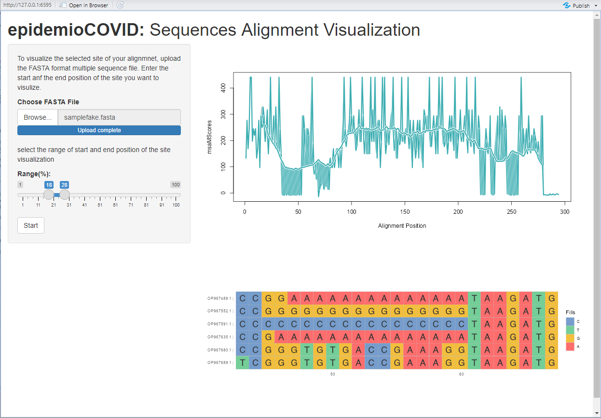
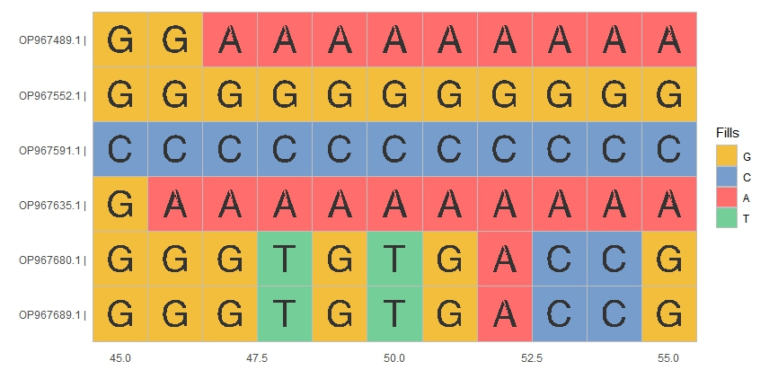

<!-- README.md is generated from README.Rmd. Please edit that file -->

```{r, include = FALSE}
knitr::opts_chunk$set(
  collapse = TRUE,
  comment = "#>",
  fig.path = "man/figures/README-",
  out.width = "100%"
)
```

# epidemioCOVID

<!-- badges: start -->
<!-- badges: end -->

## Description 

The goal of 'epidemioCOVID' is to perform alignment between user-input of COVID gene sequence data in FASTA form and the reference sequence of COVID virus and identify the mutation site of 'the user-input with a graphical visualization of the mutation site in the sequence.

This package has one helper funtion for read FASTA file, one analytic function and Two plotting functions. This package is developed under 'R version 4.2.2 (2022-10-31)' and platform 'Platform: x86_64-w64-mingw32/x64'. (64-bit).

## Installation

You can install the development version of epidemioCOVID from [GitHub](https://github.com/) with:

``` r
# install.packages("devtools")
devtools::install_github("MingLIUUU/epidemioCOVID", build_vignettes = TRUE)
library("epidemioCOVID")
```
To run the shinyApp:
``` r
runepidemioCOVID()
```


## Overview

`epidemioCOVID` contains 4 funtions.

To list all functions available in the package:

``` r
ls("package:epidemioCOVID")
data(package = "epidemioCOVID") # optional
```
`epidemioCOVID` contains 5 functions to perform alignment between user-input of COVID gene sequence data in FASTA form and the reference sequence of COVID virus and identify the mutation site of 'the user-input with a graphical visualization of the mutation site in the sequence. The *readFASTA* is function that read the FASTA format file and turn it into input accepted by other functions. The *preAlign* function that prepare the mutiple sequnence set object generate by *readFASTA* to input of mutiple sequence alignment object. *alignMSA* is a function that uses the MUSCLE algorithm to align mutiple sequences and identify their conserved sites. 
*msaPlot* is a plotting function that takes the result of the alignment by *alignMSA* and visualize the whole sequnce in the graph. 

A quick example of using *msaPlot*

``` r
FA <- system.file("extdata", "samplefake.fasta", package = "epidemioCOVID")
seqs <- epidemioCOVID::readFASTA(FA)
msaSet <- preAlign(seqs, refseq = fakeref)
msa <- alignMSA(msaSet)
MP <- msaPlot(msa)
```


*siteVisual* is a plotting function that take the FASTA mutiple sequence file and visualize zoomed detail information of the sequnce position, and the start and end positions can be decided by the user. User is able to upload their mutiple suquence FASTA format file and doing sequnce alignment analysis. 

A quick example of using *siteVisual*

``` r
fasta <- system.file("extdata", "samplefake.fasta", package = "epidemioCOVID")
siteVisual(fasta, 45, 55)
```


  
They can also use the plotting funtion through the shiny implementation with a user-friendly graphic interface.


``` r

browseVignettes("epidemioCOVID")
```

## Contributions

This package is written by Mingzheng Liu, with coding style taughted in BCB410 class by Professor Anjali Silva. 


## References

* [Boris Steipe. “Introduction to R.”]
(http://steipe.biochemistry.utoronto.ca/bio/RPR-Introduction.html)
* [Boris Steipe. “Multiple Sequence Alignment.”]
(http://steipe.biochemistry.utoronto.ca/bio/BIN-ALI-MSA.html)

* [Silva, Anjali. “Anjalisilva/TestingPackage: A Simple R Package Illustrating 
Components of an R Package: 2019-2022 BCB410H - Applied Bioinformatics, 
University of Toronto, Canada.” GitHub.] (https://github.com/anjalisilva/TestingPackage) 

* [L Zhou, T Feng, S Xu, F Gao, TT Lam, Q Wang, T Wu, H Huang, L Zhan, L Li, Y Guan, Z Dai*, G Yu* ggmsa: a visual exploration tool for multiple sequence alignment and associated data. Briefings in Bioinformatics. DOI:10.1093/bib/bbac222]

## Acknowledgements:
This package was developed as part of an assessment for 2022
BCB410H: Applied Bioinformatics course at the University of
Toronto, Toronto, CANADA. epidemioCOVID welcomes issues,
enhancement requests, and other contributions. To submit an issue,
use the GitHub issues.
