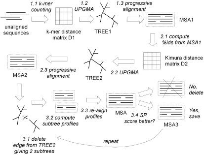

```{r setup, include=FALSE}
library(knitr)
opts_chunk$set(fig.align = "center", 
               out.width = "90%",
               fig.width = 6, fig.height = 5.5,
               dev.args=list(pointsize=10),
               par = TRUE, # needed for setting hook 
               collapse = TRUE, # collapse input & ouput code in chunks
               warning = FALSE)
knit_hooks$set(par = function(before, options, envir)
  { if(before && options$fig.show != "none") 
       par(family = "sans", mar=c(4.1,4.1,1.1,1.1), mgp=c(3,1,0), tcl=-0.5)
})
set.seed(1) # for exact reproducibility
```
       
## Introduction


**epidemioCOVID** is a simple R package for performing mutiple sequence alignment of user-input of COVID gene sequence data in FASTA form and the reference sequence of COVID virus and identify the conserved site of 'the user-input with a graphical visualization of the conserved site in the sequence. The *readFASTA* is function that read the FASTA format file and turn it into input accepted by other functions. The *preAlign* function that prepare the mutiple sequnence set object generate by *readFASTA* to input of mutiple sequence alignment object. *alignMSA* is a function that uses the MUSCLE algorithm to align mutiple sequences and identify their conserved sites. 
*msaPlot* is a plotting function that takes the result of the alignment by *alignMSA* and visualize the whole sequnce in the graph. *siteVisual* is a plotting function that take the FASTA mutiple sequence file and visualize zoomed detail information of the sequnce position, and the start and end positions can be decided by the user. User is able to upload their mutiple suquence FASTA format file and doing sequnce alignment analysis. Users can also use the plotting funtion through the shiny implementation with a user-friendly graphic interface.
It was written in R Markdown, using the [knitr](https://cran.r-project.org/package=knitr) package for production. 

See `help(package = "epidemioCOVID")` for further details and references provided by `citation("epidemioCOVID")`. To download **epidemioCOVID**, use the following commands:

``` r
require("devtools")
install_github("MingLIUUU/epidemioCOVID", build_vignettes = TRUE)
library("epidemioCOVID")
```
To list all functions available in the package:
``` r
lsf.str("package:mixGaussian")
```

<br>

## Details

The program this package used for mutiple sequence alignment is the MUltiple Sequence Comparison byLog-Expectation (MUSCLE). The main method used includes distance estimation by kmer counting, progressive alignment by log-expectation score, and tree-dependent restricted partitionin.

The overview of algorithm of MUSCLE is in the following figure.


Quote from MUSCLE: multiple sequence alignment with high accuracy and high throughput:
"There are three main stages: Stage 1 (draft progressive), Stage 2 (improved progressive) and Stage 3 (refinement). A multiple alignment is available at the completion of each stage, at which point the algorithm may terminate.

Stage 1, Draft progressive. The goal of the first stage is to produce a multiple alignment, emphasizing speed over accuracy.

1.1 The kmer distance is computed for each pair of input sequences, giving distance matrix D1.

1.2 Matrix D1 is clustered by UPGMA, producing binary tree TREE1.

1.3 A progressive alignment is constructed by following the branching order of TREE1. At each leaf, a profile is constructed from an input sequence. Nodes in the tree are visited in prefix order (children before their parent). At each internal node, a pairwise alignment is constructed of the two child profiles, giving a new profile which is assigned to that node. This produces a multiple alignment of all input sequences, MSA1, at the root.

Stage 2, Improved progressive. The main source of error in the draft progressive stage is the approximate kmer distance measure, which results in a suboptimal tree. MUSCLE therefore re-estimates the tree using the Kimura distance, which is more accurate but requires an alignment.

2.1 The Kimura distance for each pair of input sequences is computed from MSA1, giving distance matrix D2.

2.2 Matrix D2 is clustered by UPGMA, producing binary tree TREE2.

2.3 A progressive alignment is produced following TREE2 (similar to 1.3), producing multiple alignment MSA2. This is optimized by computing alignments only for subtrees whose branching orders changed relative to TREE1.

Stage 3, Refinement.

3.1 An edge is chosen from TREE2 (edges are visited in order of decreasing distance from the root).

3.2 TREE2 is divided into two subtrees by deleting the edge. The profile of the multiple alignment in each subtree is computed.

3.3 A new multiple alignment is produced by re-aligning the two profiles.

3.4 If the SP score is improved, the new alignment is kept, otherwise it is discarded.

Steps 3.1–3.4 are repeated until convergence or until a user-defined limit is reached. This is a variant of tree-dependent restricted partitioning (18).

Complete multiple alignments are available at steps 1.3, 2.3 and 3.4, at which points the algorithm may be terminated. We refer to the first two stages alone as MUSCLE-p, which produces MSA2. MUSCLE-p has time complexity $O(N^2L + NL^2)$
and space complexity $O(N^2 + NL + L^2)$. Refinement adds an $O(N^3L)$ term to the time complexity."

## References

* [Boris Steipe. “Introduction to R.”]
(http://steipe.biochemistry.utoronto.ca/bio/RPR-Introduction.html)

* [Boris Steipe. “Multiple Sequence Alignment.”]
(http://steipe.biochemistry.utoronto.ca/bio/BIN-ALI-MSA.html)
a
* [Edgar R. C. (2004). MUSCLE: multiple sequence alignment with high accuracy and high throughput. Nucleic acids research, 32(5), 1792–1797. https://doi.org/10.1093/nar/gkh340]

* [Silva, Anjali. “Anjalisilva/TestingPackage: A Simple R Package Illustrating 
Components of an R Package: 2019-2022 BCB410H - Applied Bioinformatics, 
University of Toronto, Canada.” GitHub.] (https://github.com/anjalisilva/TestingPackage) 

* [L Zhou, T Feng, S Xu, F Gao, TT Lam, Q Wang, T Wu, H Huang, L Zhan, L Li, Y Guan, Z Dai*, G Yu* ggmsa: a visual exploration tool for multiple sequence alignment and associated data. Briefings in Bioinformatics. DOI:10.1093/bib/bbac222]

----

```{r}
sessionInfo()
```
